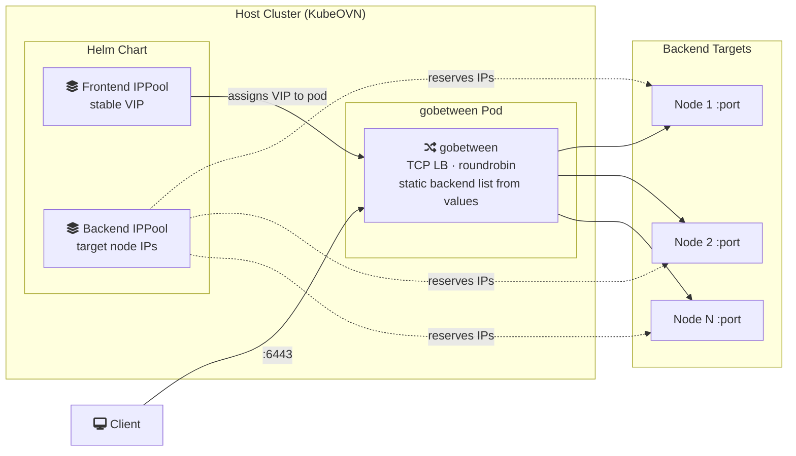

# kubeovn-gobetween

Fully declarative TCP load balancer for KubeOVN VPCs using gobetween. Frontend and backend IPs are managed via KubeOVN IPPools — all configuration lives in Helm values.

## Architecture



## How it works

1. The chart creates **KubeOVN IPPools** for both frontend (VIP) and backend (target node IPs).
2. The **gobetween pod** gets its fixed IP from the frontend IPPool via OVN annotation.
3. The **gobetween config** contains a static backend list generated directly from `backend.ipPool.ips` in values — no sidecar, no dynamic discovery.
4. **gobetween** load-balances incoming TCP connections (roundrobin) to the backend targets with ICMP health checking.
5. To update backends, change `backend.ipPool.ips` in values and run `helm upgrade`.

## Install

### Helm CLI

```bash
helm install kkp-api-lb ./charts/kubeovn-gobetween -n kubermatic \
  -f my-values.yaml
```

### Helmfile

```yaml
releases:
  - name: kkp-api-lb
    namespace: kubermatic
    chart: ./charts/kubeovn-gobetween
    values:
      - frontend:
          port: 6443
          vpc: mgmt-vpc
          subnet: mgmt-kubermatic-ext
          ipPool:
            name: mgmt-kubermatic-ext-kkp-k8s-api
            ips:
              - "10.30.31.101"
        backend:
          port: 6443
          ipPool:
            name: mgmt-kubermatic-int-kkp-cp
            subnet: mgmt-kubermatic-int
            ips:
              - "172.26.31.13"
              - "172.26.31.14"
              - "172.26.31.15"
```

#### From this repository

To consume the chart directly from this Git repository instead of a local checkout, declare it as a `git+` Helmfile repository. A ready-to-use example is in [`example/helmfile.yaml`](example/helmfile.yaml):

```yaml
repositories:
  - name: kubermatic-community
    url: git+https://github.com/kubermatic/community-components@charts/kubeovn-gobetween?ref=kubeovn-gobetween-v0.2.0

releases:
  - name: kkp-api-lb
    namespace: kubermatic
    chart: kubermatic-community/kubeovn-gobetween
    # values: same as above
```

> The `ref` points at the `kubeovn-gobetween-v0.2.0` tag (matching `Chart.yaml` version `0.2.0`); use `master` for the latest development version.

## Values

### Frontend

| Parameter              | Description                                            | Default |
| ---------------------- | ------------------------------------------------------ | ------- |
| `frontend.port`        | Listen port inside the pod                             | `6443`  |
| `frontend.vpc`         | OVN VPC (logical router) for pod placement             | `""`    |
| `frontend.subnet`      | OVN logical switch / subnet (pod placement and IPPool) | `""`    |
| `frontend.ipPool.name` | IPPool name for the stable VIP                         | `""`    |
| `frontend.ipPool.ips`  | List of frontend IPs (typically one)                   | `[]`    |

### Backend

| Parameter               | Description                      | Default |
| ----------------------- | -------------------------------- | ------- |
| `backend.port`          | Port on each backend target      | `6443`  |
| `backend.ipPool.name`   | IPPool name for backend targets  | `""`    |
| `backend.ipPool.subnet` | OVN subnet the IPPool belongs to | `""`    |
| `backend.ipPool.ips`    | List of backend target IPs       | `[]`    |

### Gobetween

| Parameter                        | Description                                 | Default                 |
| -------------------------------- | ------------------------------------------- | ----------------------- |
| `gobetween.image`                | gobetween container image                   | `yyyar/gobetween:0.8.1` |
| `gobetween.balance`              | Load balancing strategy                     | `roundrobin`            |
| `gobetween.maxConnections`       | Max concurrent connections                  | `10000`                 |
| `gobetween.healthcheck.kind`     | Health check type (`ping` requires NET_RAW) | `ping`                  |
| `gobetween.healthcheck.interval` | Health check interval                       | `10s`                   |
| `gobetween.healthcheck.timeout`  | Health check timeout                        | `2s`                    |
| `gobetween.healthcheck.fails`    | Failures before marking backend down        | `2`                     |
| `gobetween.healthcheck.passes`   | Successes before marking backend up         | `1`                     |

### Scheduling

| Parameter               | Description                              | Default                 |
| ----------------------- | ---------------------------------------- | ----------------------- |
| `priorityClass.enabled` | Create a high-priority PriorityClass     | `true`                  |
| `priorityClass.name`    | PriorityClass name                       | `gobetween-critical-lb` |
| `priorityClass.value`   | Priority value (higher = more important) | `1000000`               |

## Limitations

- **Single pod**: Currently runs as a single replica with a fixed IP. If the pod's node goes down, Kubernetes reschedules it (within ~10s due to tight tolerations), but there is brief downtime during failover.
- **Static backends**: Backend list is set at deploy time. Run `helm upgrade` to update.

## TODO

- [ ] **BGP announcement**: Announce the frontend VIP via BGP (e.g. using kube-vip, MetalLB, or FRR sidecar) to enable multi-pod HA with ECMP routing, removing the single-pod limitation.

