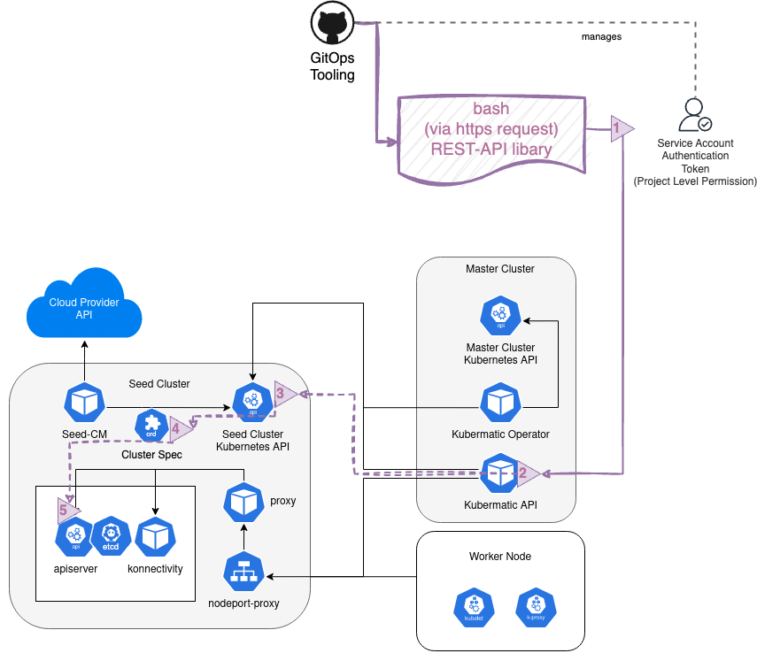
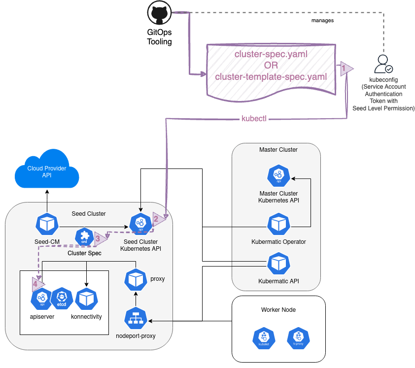

# Overview Manage Cluster via API/Cluster CRD with GitOps Tooling

## Cluster Provisioning by API via Bash/Curl

see [Cluster Provisioning by API via Bash/Curl](./cluster-management-by-api/README.md).

## KKP Terraform REST Provider

see [KKP Terraform REST Provider](./terraform-kkp-cluster-provider/README.md).

## Cluster management for KKP with Cluster CRDs

see [Cluster management for KKP with Cluster CRDs](./cluster-management-by-crds/README.md).

---

> Image Source: local [kkp-rest-API-Terraform-Cluster-CRD-Architecture-Drawing.drawio.xml](.assets/kkp-rest-API-Terraform-Cluster-CRD-Architecture-Drawing.drawio.xml) or [Google Drive](https://drive.google.com/file/d/1G8-AerEndAkR17ON4DOIrOAb_-OxEVnH/view?usp=sharing)
