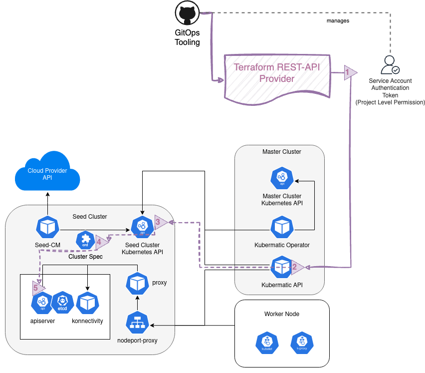

# KKP Terraform REST Provider

The following provider manage a KKP user cluster based on from the [KKP Rest API](https://docs.kubermatic.com/kubermatic/main/references/rest-api-reference/).

The provider json templates under For more Information, 

To access KKP Rest API, an API token of type `Editor` will get needed for this example, see [Using Service Accounts](https://docs.kubermatic.com/kubermatic/main/architecture/concept/kkp-concepts/service-account/using-service-account/)

## Architecture

Using the given example inside of any GitOps Tooling, the following workflow is given:


> Image Source: local [kkp-rest-API-Terraform-Cluster-CRD-Architecture-Drawing.drawio.xml](../.assets/kkp-rest-API-Terraform-Cluster-CRD-Architecture-Drawing.drawio.xml) or [Google Drive](https://drive.google.com/file/d/1G8-AerEndAkR17ON4DOIrOAb_-OxEVnH/view?usp=sharing)

> Image Source: local [kkp-rest-API-Terraform-Cluster-CRD-Architecture-Drawing.drawio.xml](../.assets/kkp-rest-API-Terraform-Cluster-CRD-Architecture-Drawing.drawio.xml) or [Google Drive](https://drive.google.com/file/d/1G8-AerEndAkR17ON4DOIrOAb_-OxEVnH/view?usp=sharing)

1) Use Authentication Token provided by the [KKP Service Accounts](https://docs.kubermatic.com/kubermatic/main/architecture/concept/kkp-concepts/service-account/using-service-account/) as Headers of the curl request.
2) Talk to the [KKP Rest API](https://docs.kubermatic.com/kubermatic/main/references/rest-api-reference/) with the given payload, what have been rendered by the terraform module
3) Kubermatic API transfers the API JSON payload to [Cluster](https://docs.kubermatic.com/kubermatic/main/references/crds/#cluster) object and applies it against the matching Seed Cluster Kubernetes API endpoint.
4) Seed Controller Managers use the [ClusterSpec](https://docs.kubermatic.com/kubermatic/main/references/crds/#clusterspec) and create the necessary specs for the Control Plan creation of a [KP user cluster](https://docs.kubermatic.com/kubermatic/main/architecture/#user-cluster)
5) Containerized Control Plane objects spins up (Deployments & StatefulSets) and seed controller manager creates necessary external cloud provider resources (e.g., a security group at the external cloud).


## Example

1. create a `terraform.tfvars`, based on in example [terraform.kubevirt.example.tfvars](./terraform.kubevirt.example.tfvars)
```bash
cd custom-components/terraform-kkp-cluster-provider
cp terraform.kubevirt.example.tfvars terraform.tfvars

# adjust variables, and add API Token 
vim terraform.tfvars

# check
cat terraform.tfvars
```
```
api_token =  "YOUR-ACCOUNT-TOKEN" #KKP Service Account Token
project_id   = "YOUR-PROJECT_ID" #KKP project ID
cluster_name = "terraform-example-dev"
```
  * *NOTE:* If more variables should be edited check [variables.tf](variables.tf) definition! 

2. Create Cluster via terraform
```bash
terraform init
terraform apply
```
```
#...

Outputs:

k8s_id = "b2sj5trqb9"
k8s_kubeconfig = "kubeconfig-b2sj5trqb9"
k8s_name = "terraform-example-dev"
k8s_url = "https://b2sj5trqb9.run-2.lab.kubermatic.io:6443"
```
  * *NOTE:* If some Error like `Error: unexpected response code '503': {"error":{"code":503,"message":"Cluster components are not ready yet"}}` occurs, it could be that some components needs a little more time to get finished. Just check the KKP Dashbaoard and try again `terraform apply` after the control plane is up.

3. Check Cluster access via `kubectl` and the created `kubeconfig-cluster-id-xxx`:
```bash
export KUBECONFIG=kubeconfig-b2sj5trqb9
kubectl get md,ms,ma,node -A
```
```
NAMESPACE     NAME                                                              REPLICAS   AVAILABLE-REPLICAS   PROVIDER   OS       KUBELET   AGE
kube-system   machinedeployment.cluster.k8s.io/terraform-example-dev-node   3                               kubevirt   ubuntu   1.24.9    7m9s

NAMESPACE     NAME                                                                  REPLICAS   AVAILABLE-REPLICAS   PROVIDER   OS       MACHINEDEPLOYMENT                KUBELET   AGE
kube-system   machineset.cluster.k8s.io/terraform-example-dev-node-78c49b98db   3                               kubevirt   ubuntu   terraform-example-dev-node   1.24.9    7m9s

NAMESPACE     NAME                                                                     PROVIDER   OS       NODE                                              KUBELET   ADDRESS        AGE
kube-system   machine.cluster.k8s.io/terraform-example-dev-node-78c49b98db-52975   kubevirt   ubuntu   terraform-example-dev-node-78c49b98db-52975   1.24.9    10.244.3.103   7m9s
kube-system   machine.cluster.k8s.io/terraform-example-dev-node-78c49b98db-7vsmj   kubevirt   ubuntu   terraform-example-dev-node-78c49b98db-7vsmj   1.24.9    10.244.5.42    7m9s
kube-system   machine.cluster.k8s.io/terraform-example-dev-node-78c49b98db-9cs64   kubevirt   ubuntu   terraform-example-dev-node-78c49b98db-9cs64   1.24.9    10.244.2.78    7m9s

NAMESPACE   NAME                                                   STATUS     ROLES    AGE   VERSION
            node/terraform-example-dev-node-78c49b98db-52975   NotReady   <none>   17s   v1.24.9
            node/terraform-example-dev-node-78c49b98db-7vsmj   NotReady   <none>   7s    v1.24.9
            node/terraform-example-dev-node-78c49b98db-9cs64   NotReady   <none>   17s   v1.24.9
```
  * *NOTE:* If some `NODE` objects are not shown up, it could take up 10 min to provision the whole nodes, depending on the datacenter utilization. You could also try `watch kubectl get md,ms,ma,node -A`

4. Destroy a Cluster
```bash
terraform destroy
```
```
Plan: 0 to add, 0 to change, 6 to destroy.

Changes to Outputs:
  - k8s_id         = "b2sj5trqb9" -> null
  - k8s_kubeconfig = "kubeconfig-b2sj5trqb9" -> null
  - k8s_name       = "terraform-example-dev" -> null
  - k8s_url        = "https://b2sj5trqb9.run-2.lab.kubermatic.io:6443" -> null

Do you really want to destroy all resources?
  Terraform will destroy all your managed infrastructure, as shown above.
  There is no undo. Only 'yes' will be accepted to confirm.

  Enter a value: yes

null_resource.kubeconfig: Destroying... [id=3357773382106992637]
time_sleep.wait_20_seconds: Destroying... [id=2023-02-17T23:21:35Z]
time_sleep.wait_20_seconds: Destruction complete after 0s
null_resource.kubeconfig: Destruction complete after 0s
restapi_object.machinedeployment_create: Destroying... [id=terraform-example-dev-node]
restapi_object.machinedeployment_create: Destruction complete after 0s
time_sleep.wait_60_seconds: Destroying... [id=2023-02-17T23:22:15Z]
restapi_object.cluster_create: Destroying... [id=b2sj5trqb9]
time_sleep.wait_60_seconds: Destruction complete after 0s
null_resource.previous: Destroying... [id=2989688693603946775]
null_resource.previous: Destruction complete after 0s
restapi_object.cluster_create: Destruction complete after 1s

Destroy complete! Resources: 6 destroyed.
```

## Terraform Provider Docs
Generated via: `terraform-docs markdown table --output-file README.md --output-mode inject ./`

<!-- BEGIN_TF_DOCS -->
## Requirements

| Name | Version |
|------|---------|
| <a name="requirement_restapi"></a> [restapi](#requirement\_restapi) | 1.18.2 |

## Providers

| Name | Version |
|------|---------|
| <a name="provider_local"></a> [local](#provider\_local) | 2.4.0 |
| <a name="provider_null"></a> [null](#provider\_null) | 3.2.1 |
| <a name="provider_restapi"></a> [restapi](#provider\_restapi) | 1.18.2 |

## Modules

No modules.

## Resources

| Name | Type |
|------|------|
| [null_resource.kubeconfig](https://registry.terraform.io/providers/hashicorp/null/latest/docs/resources/resource) | resource |
| [null_resource.wait_cluster_creation](https://registry.terraform.io/providers/hashicorp/null/latest/docs/resources/resource) | resource |
| [restapi_object.addon_create](https://registry.terraform.io/providers/Mastercard/restapi/1.18.2/docs/resources/object) | resource |
| [restapi_object.cluster_apply](https://registry.terraform.io/providers/Mastercard/restapi/1.18.2/docs/resources/object) | resource |
| [restapi_object.machinedeployment_create](https://registry.terraform.io/providers/Mastercard/restapi/1.18.2/docs/resources/object) | resource |
| [local_file.common_script](https://registry.terraform.io/providers/hashicorp/local/latest/docs/data-sources/file) | data source |

## Inputs

| Name | Description | Type | Default | Required |
|------|-------------|------|---------|:--------:|
| <a name="input_api_base_url"></a> [api\_base\_url](#input\_api\_base\_url) | KKP base URL | `string` | `"https://mgmt-prod.cp.3ascloud.de/api"` | no |
| <a name="input_api_token"></a> [api\_token](#input\_api\_token) | KKP admin token, see https://docs.kubermatic.com/kubermatic/v2.21/architecture/concept/kkp-concepts/service-account/using-service-account/ | `string` | n/a | yes |
| <a name="input_cluster_name"></a> [cluster\_name](#input\_cluster\_name) | User Cluster Name | `string` | `"test-tf-cluster"` | no |
| <a name="input_cluster_spec_folder"></a> [cluster\_spec\_folder](#input\_cluster\_spec\_folder) | Folder what contains the cluster spec jsons | `string` | `"kubevirt_cluster_example"` | no |
| <a name="input_cni_plugin"></a> [cni\_plugin](#input\_cni\_plugin) | CNI Pluging name: cilium or canal | `string` | `"cilium"` | no |
| <a name="input_cni_version"></a> [cni\_version](#input\_cni\_version) | Version of the CNI Plugin | `string` | `"1.13.8"` | no |
| <a name="input_common_bash_file_path"></a> [common\_bash\_file\_path](#input\_common\_bash\_file\_path) | Helper file for some bash functions | `string` | `"_common.sh"` | no |
| <a name="input_credential_preset_name"></a> [credential\_preset\_name](#input\_credential\_preset\_name) | Preset to use while creating the user cluster | `string` | `"TODO-ADD-PRESET-NAME"` | no |
| <a name="input_dc"></a> [dc](#input\_dc) | Datacenter name at a Kubermatic Seed | `string` | `"fra-prod"` | no |
| <a name="input_kubernetes_version"></a> [kubernetes\_version](#input\_kubernetes\_version) | User Cluster Kubernetes Version | `string` | `"1.26.9"` | no |
| <a name="input_kubevirt_machine_spec"></a> [kubevirt\_machine\_spec](#input\_kubevirt\_machine\_spec) | A selection of parameter for a kubevirt machine object specification. | <pre>object({<br>    cpus         = number<br>    memory       = string<br>    disk_size    = string<br>    os_image_url = string<br>    primary_disk_storage_class = string<br>  })</pre> | <pre>{<br>  "cpus": 8,<br>  "disk_size": "150Gi",<br>  "memory": "32768Mi",<br>  "os_image_url": "http://TODO.your.image.url/vms/ubuntu-22.04.img",<br>  "primary_disk_storage_class": "TODO_YOUR_STORAGE_CLASS"<br>}</pre> | no |
| <a name="input_machine_osp_name"></a> [machine\_osp\_name](#input\_machine\_osp\_name) | Name of the selected Operating System Profile (OSP) for the machine controller | `string` | `"osp-ubuntu"` | no |
| <a name="input_machine_replica"></a> [machine\_replica](#input\_machine\_replica) | Replica of initial created Machines | `number` | `2` | no |
| <a name="input_project_id"></a> [project\_id](#input\_project\_id) | KKP Project Id | `string` | `"TODO_PROJECT_ID"` | no |

## Outputs

| Name | Description |
|------|-------------|
| <a name="output_k8s_id"></a> [k8s\_id](#output\_k8s\_id) | K8S ID |
| <a name="output_k8s_kubeconfig"></a> [k8s\_kubeconfig](#output\_k8s\_kubeconfig) | K8S kubeconfig |
| <a name="output_k8s_name"></a> [k8s\_name](#output\_k8s\_name) | K8S Name |
| <a name="output_k8s_url"></a> [k8s\_url](#output\_k8s\_url) | K8S URL |
<!-- END_TF_DOCS -->