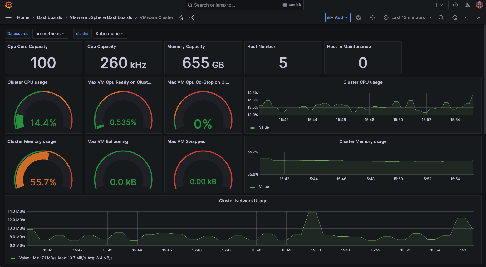

# VMWare Exporter & Dashboard for KKP
_Last modified: 2023-10-26_

The chart contains the following components:
- vm-exporter helm chart, sourced from [kremers/charts-vmware-exporter](https://github.com/kremers/charts-vmware-exporter)
- grafana dashboards, included from [pryorda/vmware_exporter - dashboards](https://github.com/pryorda/vmware_exporter/tree/main/dashboards)



## Configure KKP
Based on the documentation [Customization of the Master / Seed MLA Stack - Grafana Dashboards](https://docs.kubermatic.com/kubermatic/v2.23/tutorials-howtos/monitoring-logging-alerting/master-seed/customization/#grafana-dashboards), KKP needs the dashboards at the `monitoring` namespace to get used. This already configured as default for the helm chart:
```yaml
vmware-exporter:
  grafana:
    configmap:
      namespace: monitoring
      name: vsphere-dashboard
```
Additionally, we need to configure the KKP values yaml to include the new dashboard configmap. The scraping of the vmware exporter metrics is by default already enabled. As first step we need include the authentication to the vSphere for the deployment:
```yaml
# KKP values.yaml
vmware-exporter:
  vsphere:
    user: "xxx-TODO-VIEW-ONLY-USER-xxx"
    password: "xxx-TODO-PW-xxx"
    host: "xxx-TODO-VSPHERE-HOST-xxx"
```
After this, we need to set as final step the `grafana:` config
```yaml
# KKP values.yaml
# ====== grafana ======
grafana:
  provisioning:
    dashboards:
      extra:
        - folder: "VMware vSphere Dashboards"
          name: "vsphere-dashboard"
          options:
            path: /grafana-dashboard-definitions/vsphere-dashboard
          org_id: 1
          type: file
  volumes:
    - name: vsphere-dashboard
      mountPath: /grafana-dashboard-definitions/vsphere-dashboard
      configMap: vsphere-dashboard
```
## Rollout
To roll out the custom dashboard, you can just deploy the `grafana` and `vmware-exporter` helm chart
```bash
helm --namespace monitoring upgrade --install --wait --values /path/to/your/helm-values.yaml vmware-exporter /path/to/community-components/components/vmware-exporter
helm --namespace monitoring upgrade --install --wait --values /path/to/your/helm-values.yaml grafana charts/monitoring/grafana/
```

---
Original README 👉 [charts/vmware-exporter/README.md](./charts/vmware-exporter/README.md)
---

