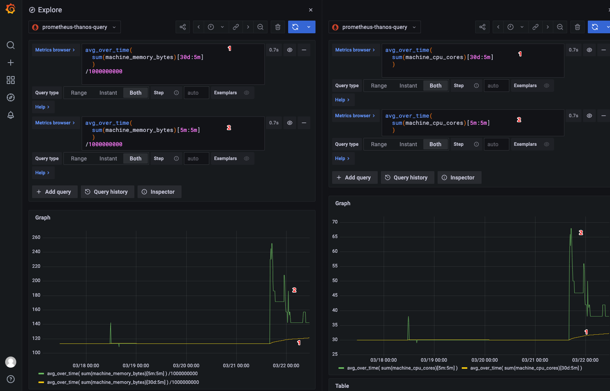

# How to collect the provisioned CPU/Memory of Kubernetes Clusters

## Note for KKP Capacity
For determination of the KKP Subscription relevant metrics, ONLY the average user cluster provisioned capacity of CPU/Memory of all worker nodes is relevant. This excludes the master/seed clusters capacity usage. For KKP EE users Kubermatic provides an integrated metering tooling, what calculates daily/weekly/monthly consumption reports, see [KKP Docs > Metering (EE)](https://docs.kubermatic.com/kubermatic/master/tutorials_howtos/metering/).

## Option 1: Prometheus metrics

As Prometheus metrics are mostly a standard monitoring tool you could use the following queries to determine the average resource consumption of your cluster. If you have installed and enabled the KKP monitoring stack, you have this metrics already available:
* [Master/Seed MLA](https://docs.kubermatic.com/kubermatic/master/architecture/monitoring_logging_alerting/master_seed/)
* [User Cluster MLA:](https://docs.kubermatic.com/kubermatic/master/architecture/monitoring_logging_alerting/user_cluster/)

Otherwise, you could also use or existing prometheus or install it over the common [prometheus community charts](https://github.com/prometheus-community/helm-charts).

### CPU
To determine the average CPU, we would need to respect the time dimension. Depending on your existing data you could collect the average sum of the `machine_cpu_cores` metric:
```promql
avg_over_time(
  sum(machine_cpu_cores)[30d:5m]
  )
```
Result: Average Cores of all cluster nodes over the last 30 days

### Memory
To determine the average Memory, we would need to respect the time dimension. Depending on your existing data you could collect the average sum of the `machine_memory_bytes` metric:
```promql
avg_over_time(
  sum(machine_memory_bytes)[30d:5m]
  )
/1000000000
```
Result: Average Memory in Gigabyte of all cluster nodes over the last 30 days

### Why average consumption metric is used?
The 30d average vector respecting over time some over and under provisioning and covers temporary scaling. As this metric is way more deterministic it's used for KKP subscription calculation, see the following comparison:


`1` Is showing the average calculation over 30 days `2` Is showing the spikes during some resizing

As the `1` graph is showing clearly, the resizing only has a long term consumption effect, what gives users the possibility to scale based on their current needs.  

## Option 2: kube-capacity kubectl plugin

For existing clusters where no monitoring data is present you could use the [kubectl krew](https://krew.sigs.k8s.io/) plugin [kube-capacity](https://github.com/robscott/kube-capacity). It helps to collect the overall available CPU and Memory of your Cluster. Please execute the query to a representative point in time as KKP EE subscription is based on the average consumption metrics.

### Installation
* Krew: [Installing Krew kubectl plugin](https://krew.sigs.k8s.io/docs/user-guide/setup/install/)
* kube-capacity: [`kubectl krew install resource-capacity`](https://github.com/robscott/kube-capacity#installation)

### Collect provisioned CPU/Memory
The command `kubectl resource_capacity` is now available and provides detailed information about the resource capacity management of your cluster. To collect and display the provisioned CPU/Memory information, the option `--available` is needed:

```bash
kubectl resource_capacity --available
```
```
NODE                                        CPU REQUESTS    CPU LIMITS       MEMORY REQUESTS    MEMORY LIMITS
*                                           14002m/34800m   -39800m/34800m   72297Mi/131476Mi   -3370Mi/131476Mi
example-cp-0                                825m/2000m      1350m/2000m      7337Mi/7854Mi      7330Mi/7854Mi
example-cp-1                                825m/2000m      1450m/2000m      7567Mi/7854Mi      7460Mi/7854Mi
example-cp-2                                825m/2000m      1450m/2000m      7567Mi/7854Mi      7460Mi/7854Mi
example-worker-zone-1-5dc5f7c77f-pkn8d      710m/3600m      -7800m/3600m     4183Mi/13490Mi     -9054Mi/13490Mi
example-worker-zone-1-5dc5f7c77f-qr9rn      802m/3600m      -13000m/3600m    4197Mi/13490Mi     -12924Mi/13490Mi
example-worker-zone-2-f5dd888c7-rtv7w       370m/3600m      -7400m/3600m     2737Mi/13490Mi     -13456Mi/13490Mi
example-worker-zone-2-f5dd888c7-vgzhh       85m/3600m       -15750m/3600m    2524Mi/13490Mi     -16864Mi/13490Mi
example-worker-zone-3-6f644fdbcc-nprdl      435m/3600m      -8150m/3600m     2076Mi/13490Mi     -12558Mi/13490Mi
example-infra-mla-zone-1-584dfcbf7d-2l87g   3090m/3600m     3150m/3600m      11801Mi/13490Mi    13294Mi/13490Mi
example-infra-mla-zone-2-86c9fbf796-6fgkb   3015m/3600m     2150m/3600m      13137Mi/13490Mi    12782Mi/13490Mi
example-infra-mla-zone-3-75b4488cbd-q4cjc   3020m/3600m     2750m/3600m      9177Mi/13490Mi     13166Mi/13490Mi
```
In this case we see a kubeone cluster what has a VM based control plane (in difference to KKP user clusters), what holding in total `34800m` milli-cores (`34.8 Cores`) and `131476Mi` Megabyte (`131.4 Gigabyte`) provisioned capacity.
To determine the full capacity the `*` line entry is the important entry. The second value `CPU REQUESTS  14002m/34800m` and `MEMORY REQUESTS 72297Mi/131476Mi` is holding the available capacity.

For KKP user clusters you would seed the capacity without the control plan nodes `example-cp-X`:
```bash
kubectl resource_capacity --available
```
```
NODE                                 CPU REQUESTS   CPU LIMITS    MEMORY REQUESTS   MEMORY LIMITS
*                                    5300m/9600m    1400m/9600m   17283Mi/20617Mi   10673Mi/20617Mi
example-kkp-worker-9fc446f6b-4hrwc   975m/1600m     650m/1600m    3141Mi/3437Mi     2545Mi/3437Mi
example-kkp-worker-9fc446f6b-8k6c4   745m/1600m     750m/1600m    2815Mi/3437Mi     2813Mi/3437Mi
example-kkp-worker-9fc446f6b-b7mrz   1025m/1600m    1050m/1600m   3193Mi/3437Mi     2703Mi/3437Mi
example-kkp-worker-9fc446f6b-nglxn   765m/1600m     -350m/1600m   2675Mi/3437Mi     1899Mi/3437Mi
example-kkp-worker-9fc446f6b-nslzs   865m/1600m     -650m/1600m   2625Mi/3437Mi     -1601Mi/3437Mi
example-kkp-worker-9fc446f6b-q7v2t   925m/1600m     -50m/1600m    2839Mi/3437Mi     2319Mi/3437Mi
```
In this case we have in total `9600m` milli-cores (`9.6 Cores`) and `20617Mi` Megabyte (`20.5 Gigabyte`) for this user cluster.

