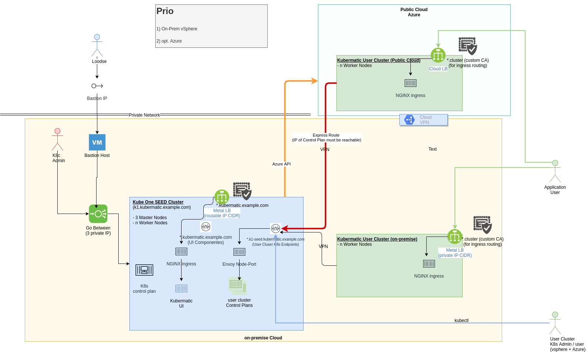
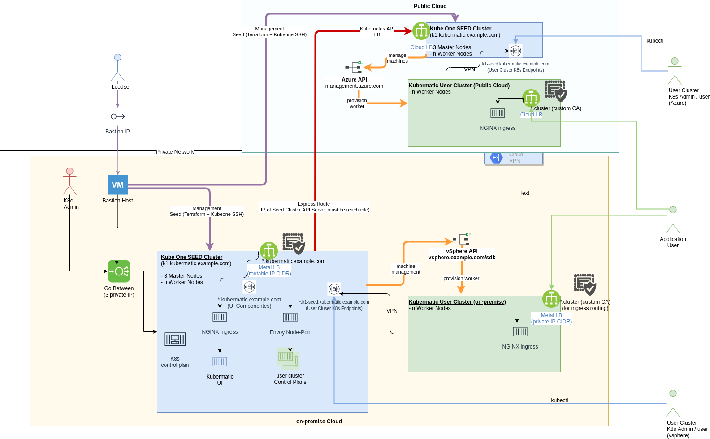

# Additional Requirements for Azure Adoption

## General Requirements

* Azure Account described at: [Kubermatic Docs > Requirements > Azure](https://docs.kubermatic.com/kubermatic/master/requirements/cloud_provider/_azure/)
    * Azure Network
        * Regions (which are routed and accessible over Kubermatic)
        * VNet with big enough IP range for all planed worker VMs:
            * for a small setup `/24` should be enough
            * subnet with expected routing needs be setup as well
                        
    * Azure Cloud Resources managed by [Kubernetes Azure Cloud Provider](https://github.com/kubernetes-sigs/cloud-provider-azure)
        * Kubermatic will create on-demand resources like volumes and LoadBalancer, ensure the permissions and infrastructure setup is enabled for it, see [SIG - Cloud Provider Azure - Permissions](https://kubernetes-sigs.github.io/cloud-provider-azure/topics/azure-permissions/)
        * Also ensure that API is reachable from the seed and worker node network, see [Azure API Docs](https://docs.microsoft.com/en-us/rest/api/azure/)

    * Azure Machine Deployment information:
        * Ensure for KubeOne seed the initial terraform module can be applied [Azure Quickstart Terraform configs](https://github.com/kubermatic/kubeone/tree/master/examples/terraform/azure) by using the [Terraform Azure Provider](https://www.terraform.io/docs/providers/azurerm/index.html)
        * Ensure to share the needed parameter of [Azure - machine.spec.providerConfig.cloudProviderSpec](https://github.com/kubermatic/machine-controller/blob/master/docs/cloud-provider.md#machinespecproviderconfigcloudproviderspec-7)
        
## Integration Option to existing KKP

### Option I - Workers only in Azure

* Worker Node IP Range need to reach seed cluster user control plan endpoints, see [Expose Strategy](https://docs.kubermatic.com/kubermatic/master/concepts/expose-strategy/expose_strategy)
* KKP will create then a secure VPN tunnel between worker and control plan, so no way back connection need to be opened
* Existing seed need to reach Azure API endpoints for the machine provisioning
* Application traffic get exposed at Azure workers (Cloud LBs)
        
### Option II - Additional Seed at Azure + Worker in Azure

* Seed Cluster Kubernetes API endpoint at Azure need to be reachable
    * Azure Load Balancer with `https` endpoint
* Worker Node IP Range needs to talk to additional `node-port` load balancer at the seed cluster
    * Additional DNS entry for Azure seed is needed e.g. `*.azure-seed.kubermatic.example.com`
    * Workers <-> Seed communication is in the Azure Net only
* User Cluster users need to reach the azure seed cluster load balancer `node-port`
    * IP/DNS of azure LoadBalancer
* Application traffic get exposed at Azure workers (Cloud LBs)
* Host for Seed provisioning (KubeOne setup) needs to reach the azure network VMs by SSH
