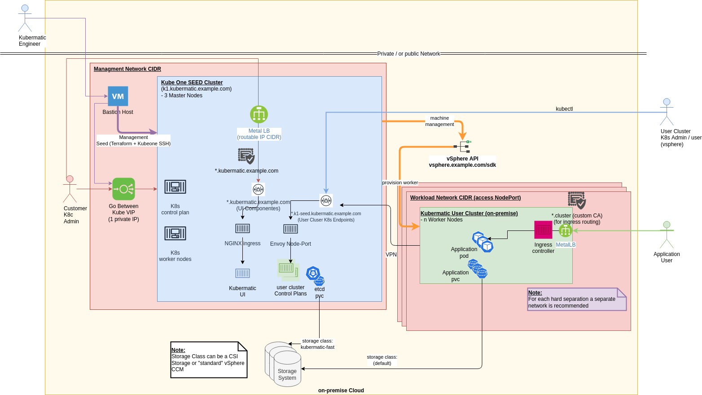

# vSphere Mulit Tenancy and Credential Management
***Date: 2021-12-03***

The following described usage of the credentials is currently recommend, as long as further improvement are not finished. One prerequisite for this was already released with KKP 2.18.2, see [PR #7280](https://github.com/kubermatic/kubermatic/pull/7280).
The tracking issue for fixing the credential handling is: [#4974](https://github.com/kubermatic/kubermatic/issues/4974)

To ensure isolation of environments, currently it's recommended to do the following steps for the vSphere Cloud Provider:

1. At vSphere Isolation could only achieved by permissions and separation of dedicated resources on the Infrastructure Level (out-of-scope for KKP / Kubernetes). A first recommendation is drawn into the following architecutre picture. Some additional notes to it:

  - Network: by default vsphere uses a flat network everyone could at least talk to each other

  - Storage: Permissions needs to be separated by data store storage

  - Compute: Folders / Compute Resources could be separated by folders and resource pools

Link to editable Diagramm: [KKP Seed Setups](https://app.diagrams.net/#G185kWwn1yEjKKIiTZzEEzVwoRK5XDxoqc), [GDrive](https://drive.google.com/file/d/185kWwn1yEjKKIiTZzEEzVwoRK5XDxoqc/view?usp=sharing)

2. Per Tenant (unique entity, what could be a single cluster / project / stage / etc.) a unique set of user pair is recommended:
  - Seed Cluster (Naming is misleading) - holding the cloud provider CCM credentials - Lower permissions what are visible inside of user clusters, see [#4974](https://github.com/kubermatic/kubermatic/issues/4974). This credentials get used also for the storage mounting.
  - User Cluster - stored in the seed cluster for the machine controller to create and manage machines for their cluster. This higher privileged user won't get exposed the user cluster if the "vSphere Cloud credentials" are set (see attached screenshot)

3. Additional Options to separate (support by Consulting possible):
  - Network: Calico host protection rules could get developed to ensure cluster-to-cluster isolation, see https://docs.projectcalico.org/archive/v3.21/security/protect-hosts. This additional protection rules could be then enforced by some KKP addon
  - Datastore / vsphere Permission / Folder / Network and pot. external LoadBalancing routing. In best case this should by automated, so that a bootstrapping of new tentants is repeatable

  - Adjustment of the default RBAC and user Rules and host protection -  a cluster-admin "light" could be created by:
   - creating a dedicated RBAC role, what excludes the "kube-system" namespace at the user cluster

   - disable the toleration of starting privileged containers (host access possible, see for example konsole)

   - SSH Key-handling on the cluster / project handling needs to ensure that non privileged user do not have access to the used SSH keys. (If you have access to the node, privileges of RBAC could be passed and credentials could get visible)

As already mentioned further improvements are planned, but as the infrastructure layer of vSphere don't support multi-tenancy by default is not as easy to ensure this.

