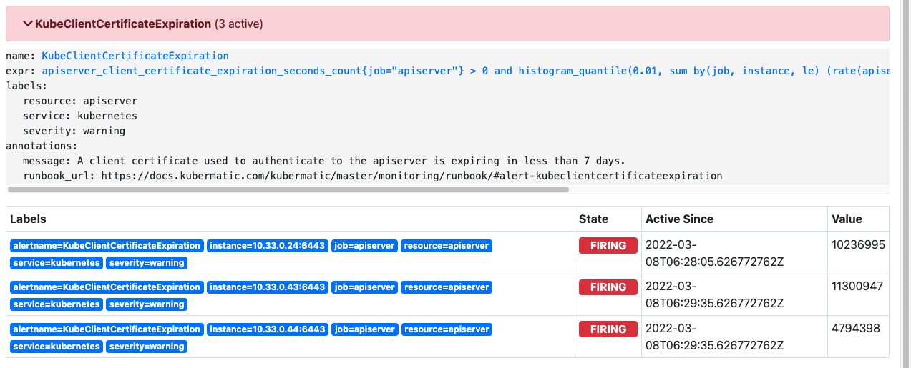

# Expiring `kubeconfig` client certificate

Based on the alert of today `2022-03-08`, we saw the following alert triggering at our CLD PROD seed cluster:


## Analysis
As out KKP alerting documentation [KKP Alerting Runbook #alert-kubeclientcertificateexpiration](https://docs.kubermatic.com/kubermatic/v2.18/cheat_sheets/alerting_runbook/#alert-kubeclientcertificateexpiration) points out we should check the expiry date of the control plane certificates. Unfortunately they won't expire in the alerted `7 days`:
```bash
root@kubeone-cp-0:~# kubeadm certs check-expiration
[check-expiration] Reading configuration from the cluster...
[check-expiration] FYI: You can look at this config file with 'kubectl -n kube-system get cm kubeadm-config -o yaml'
W0308 10:36:04.967158   22112 utils.go:69] The recommended value for "clusterDNS" in "KubeletConfiguration" is: [10.96.0.10]; the provided value is: [169.254.20.10]

CERTIFICATE                EXPIRES                  RESIDUAL TIME   CERTIFICATE AUTHORITY   EXTERNALLY MANAGED
admin.conf                 Feb 01, 2023 17:06 UTC   330d                                    no      
apiserver                  Sep 16, 2022 10:51 UTC   192d            ca                      no      
apiserver-etcd-client      Sep 16, 2022 10:51 UTC   192d            etcd-ca                 no      
apiserver-kubelet-client   Sep 16, 2022 10:51 UTC   192d            ca                      no      
controller-manager.conf    Feb 01, 2023 17:06 UTC   330d                                    no      
etcd-healthcheck-client    Aug 26, 2022 09:04 UTC   170d            etcd-ca                 no      
etcd-peer                  Aug 26, 2022 09:04 UTC   170d            etcd-ca                 no      
etcd-server                Aug 26, 2022 09:04 UTC   170d            etcd-ca                 no      
front-proxy-client         Sep 16, 2022 10:51 UTC   192d            front-proxy-ca          no      
scheduler.conf             Aug 26, 2022 09:04 UTC   170d                                    no      

CERTIFICATE AUTHORITY   EXPIRES                  RESIDUAL TIME   EXTERNALLY MANAGED
ca                      Mar 07, 2031 15:03 UTC   9y              no      
etcd-ca                 Mar 07, 2031 15:03 UTC   9y              no      
front-proxy-ca          Mar 07, 2031 15:03 UTC   9y              no     
```

After some research, there were hints that the Alert could also get triggered if other - none control plane - clients using an expiring kubeconfig with certificate authentication. A typical kubeconfig for this the admin kubeconfig what get created and updated during the setup of a kubernetes cluster. In this case `kubeone apply` create and updates it (when needed). 

Referencing github issues and docs:
- [KubeClientCertificateExpiration always alert #881](https://github.com/prometheus-operator/kube-prometheus/issues/881)
- [Certificate Management with kubeadm
](https://kubernetes.io/docs/tasks/administer-cluster/kubeadm/kubeadm-certs/)
- [Kubelet client certificate rotation fails](https://kubernetes.io/docs/setup/production-environment/tools/kubeadm/troubleshooting-kubeadm/#kubelet-client-cert)

### Check expiry date of `kubeconfig` certificates

1. get your certificates by printing the kubeconfig:
```
cat $KUBECONFIG
apiVersion: v1
clusters:
- cluster:
    certificate-authority-data: ___base64-encoded-ca-cert___
    server: https://kube.apiserver.url:6443
  name: kubeone
contexts:
- context:
    cluster: kubeone
    user: kubernetes-admin
  name: kubernetes-admin@kubeone
current-context: kubernetes-admin@kubeone
kind: Config
preferences: {}
users:
- name: kubernetes-admin
  user:
    client-certificate-data: ___base64-encoded-cert___
    client-key-data: ___base64-encoded-key___
```
2. Decode the certificates
   1. Create of each certificate you want to check (normally `certificate-authority-data` and `client-certificate-data`) a separate file and copy in the `base64` encoded content of it (above it is `___base64-encoded-ca-cert___` or `___base64-encoded-cert___`).
   2. Decode of the certificate:
      ```bash
      base64 -d base64-encoded-ca-cert.txt kubeconf.admin.ca-cert.pem
      base64 -d base64-encoded-cert.txt kubeconf.admin.client.pem
      ```
3. Check expiration date
   ```
   openssl x509 -enddate -noout -in kubeconf.admin.ca-cert.pem
   
   notAfter=Mar  7 15:03:01 2031 GMT
   ```
   ```
   openssl x509 -enddate -noout -in kubeconf.admin.client.pem
   
   notAfter=Mar  9 15:03:05 2022 GMT
   ```
   
### Result

As you could see the CA certificate is valid until `2031`. The client certificate will expire soon at `Mar  9 15:03:05 2022 GMT`, what could lead to the above Alert.
The control plan certificates are renewed a while ago, so this means also the potential admin kubeconfig should be renewed. So it looks like the used (or committed) kubeconfig `kubeone-kubeconfig` was not updated accordingly.

## Solution: Update `kubeconfig`

1. Download recent `kubeconfig` file from the seed cluster by using `kubeone kubeconfig`:
   ```bash
   ### SSH access required
   kubeone kubeconfig > new-kubeconfig
   ```
2. New kubeconfig as been downloaded, check certificate expiration date like described above.
  ```bash
  cd - 
  cat secrets/kubeone-kubeconfig
  
  ... see above steps
  
  notAfter=Feb  1 17:06:34 2023 GMT
  ```
4. Commit or distribute the updated `kubeconfig` to all of your teammates


**NOTE:** In the past sometimes the `kubeconfig` updates (due to namespace changes) has been removed from tracking via `git update-index --skip-worktree FILE_PATH`. If this happened ensure your change get committed: 
1. Ensure your local git is tracking the changed `kubeconfig`:
  ```bash
  git update-index --no-skip-worktree secrets/kubeone-kubeconfig
  ```
2. Checkout the branch with the change (normally `master`) and ensure you receive the update
  ```bash
  git checkout branch-of-changed-kubeconfig
  git pull
  ### check with 100 commit before current master  
  git diff origin/master~100 secrets/kubeone-kubeconfig
  ```
  you should see some difference:
  ```bash
  diff --git a/secrets/kubeone-kubeconfig b/secrets/kubeone-kubeconfig
  index d78018c..d65dcfc 100644
  --- a/secrets/kubeone-kubeconfig
  +++ b/secrets/kubeone-kubeconfig
  @@ -1,20 +1 @@
  ```
3. Check like described above the client secret expire date:
  ```bash
  cat secrets/kubeone-kubeconfig
  
  ... see above steps
  
  notAfter=Feb  1 17:06:34 2023 GMT
  ```