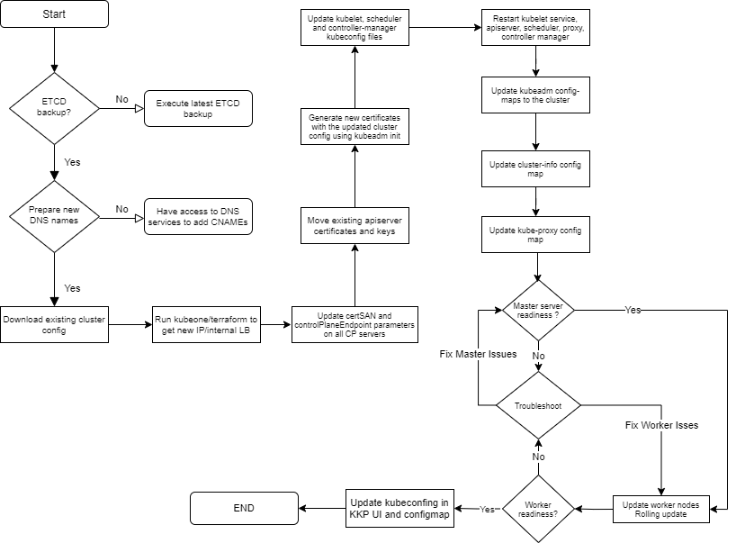
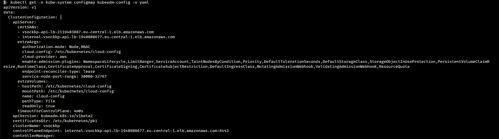

## Changing IP address/hostname of an existing Kubernetes cluster  ##

<br>

### 1.0 Introduction

There can be scenarios where we will have to change IP of an existing kubernetes cluster. If we try and change IP on an existing cluster we will end up messing up connectivity between various components in the cluster where API server come into picture. Apart from that we will face issues pertaining to certificate issues as the SAN (Subject Alternate Name) will not have the new IP address.

The process of changing IP address/DNS name could find use for a few different scenarios. A couple of situations  such as

- Adding a load balancer in front of the control plane.
- Using a new or different URL/hostname to access the API server.
- New DHCP leases/IP getting used by other hosts in a data centre.

Changing the IP of the existing cluster will have multiple steps involved and the flowchart for the same is depicted below.



### 2.0 Prerequisites (will not be covered in the document)

* Detailed procedure for the below mentioned in  not in the preview of this runbook*

- Backup etcd.
- Have the new IP/hostnames in place and adding required firewall rules for the same.
- Cluster backup (various configs)

### 3.0 Steps involved

* Initial step will be to download the existing cluster configuration to a file using the below command.

  ```
  kubectl get configmap -n kube-system kubeadm-config -o jsonpath='{.data.ClusterConfiguration}' > kubeadm-config.yaml

  ```

* Modify terraform.tfvars to chnage the loadbalancer scheme as below.

  ```
  internal_api_lb = true

  ```
* Once the tfvars is modified do a terraform apply with the below command

  ```
  terraform apply
  ```

* Modify the configmap with the new SAN and controlplan end points


* Modify admin.conf file for **server** parameters on all master nodes (as per the below diagram).

  ```
  kubectl edit -n kube-system configmap kubeadm-config

  ```
  Please use below image as a reference for doing the edit

  


* Next is to update the SAN path of the exisiting certificates in the master nodes with new IP/hostnames.

  _First, move the existing API server certificate and key (if kubeadm sees that they already exist in the designated location, it won’t create new ones_

  ```
  mv /etc/kubernetes/pki/apiserver.{crt,key} ~
  ```

  Then, use kubeadm to just generate a new certificate:

  ```
  kubeadm init phase certs apiserver --config kubeadm-config.yaml
  ```
  This command will generate a new certificate and key for the API server, using the specified configuration file  (which was generated in the initial step) for your guidance. Since the specified configuration file includes a certSANs list, kubeadm will automatically add those SANs when creating the new certificate.

  #### 3.1 Verifying the change

    The way to verify the change is to use openssl on the control plane node to decode the certificate and show the list of SANs on the certificate:

    ```
    openssl x509 -in /etc/kubernetes/pki/apiserver.crt -text
    ```
    Look for the `X509v3 Subject Alternative Name` line, after which will be a list of all the DNS names and IP addresses that are included on the certificate as SANs. After following this procedure, you should see the newly-added names and IP addresses you specified in the modified kubeadm configuration file. If you don’t, then something went wrong along the way. Common mistakes in this process include forgetting to remove the previous certificate and key (kubeadm won’t create new ones if they already exist), or failing to include the --config kubeadm-config.yaml on the kubeadm init phase certs command.

  #### 3.2 Restarting API server

    The final step is restarting the API server to pick up the new certificate. The easiest way to do this is to kill the API server container using docker:

    Run `docker ps | grep kube-apiserver | grep -v pause` to get the container ID for the container running the Kubernetes API server. (The container ID will be the very first field in the output.)

    Run `docker kill <containerID>` to kill the container.

    If your nodes are running containerd as the container runtime, the commands are a bit different:

    Run `crictl pods | grep kube-apiserver | cut -d' ' -f1` to get the Pod ID for the Kubernetes API server Pod.

    Run `crictl stop <pod-id>` to stop the Pod.

    Run `crictl rmp <pod-id>` to remove the Pod.

    The Kubelet will automatically restart the container, which will pick up the new certificate. As soon as the API server restarts, you will immediately be able to connect to it using one of the newly-added IP addresses/DNS names.

  #### 3.3 Updating the In-Cluster Configuration
  <br>

  Assuming everything is working as expected, the final step is to update various `ConfigMap` stored in the cluster.

    - You can verify the changes to the configuration were applied successfully with this command:

    ```
    kubectl edit -n kube-system configmap kubeadm-config

    ```

    - If this is reflecting all required changes you can go ahead with updating cluster-info ConfigMap in kube-system namespace.

    ```
    kubectl edit -n kube-public cm cluster-info

    ```
    - Once completed update the kube-proxy ConfigMap in kube-system namespace

    ```
    kubectl edit -n kube-public cm kube-proxy

    ```

    - Update seed.yaml with new `KUBECONFIG` (with base64 encoding)

    ```
    cat xxxxx-kubeconfig | base64 | tr -d '\n\r'

    ```

  - Add the new encoded kubeconfig in seed.yaml as below

    ```
    apiVersion: v1
    kind: Secret
    metadata:
    name: xxxx-kubeconfig
    namespace: kubermatic
    type: Opaque
    data:
    kubeconfig: <add base64 encoded kubeconfig>
    <truncated>
    ...

    ```

  - Apply the new seed.yaml

    ```
    kubectl apply -f seed.yaml

    ```

  - Verify `/var/lib/kubelet/kubeconfig` on all master servers for its contents and ensure it reflects the new values of cluster endpoint.

Once all the above metioned activities are completed you will be able to see all the master/worker nodes in ready state and all pods in running state as well. 


